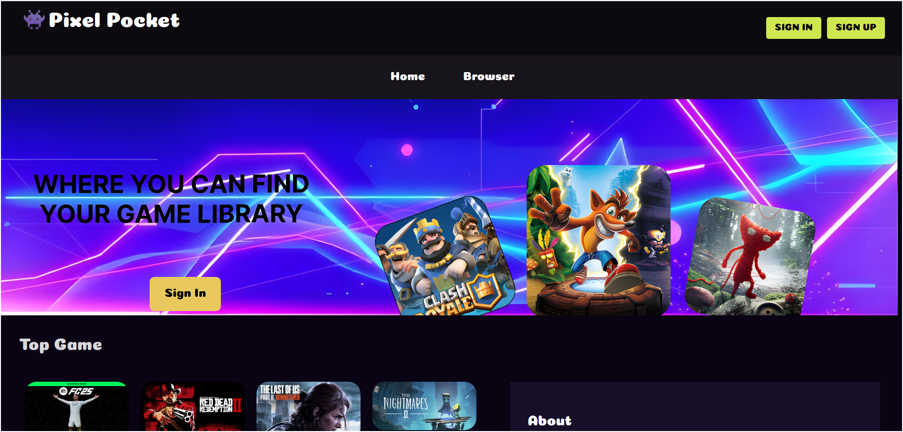

# Pixel-Pocket

- Done by: 
- 1-Haider Marhoon
- 2-Khaled Jamal
- 3-Zainab Alabbood

## 👾 App Description:

Pixel-Pocket is a web app that allows users to explore a comprehensive list of games. Users can create an account, log in, and manage their personal game collection effortlessly. The app enables you to create new game lists by adding detailed information, including ratings for each game. You can easily edit or delete entries, leave comments, and mark games as favorites. Additionally, Pixel-Pocket features a search bar on the main page, making it simple to find the games you want. Discover, organize, and enjoy your gaming experience with Pixel-Pocket!

## 🔎 Background info:

We are building the Pixel-Pocket project as part of our studies at General Assembly's Software Engineering Bootcamp. We chose to create a game list app because we find gaming and game sharing both exciting and engaging. This project is an excellent opportunity for us to practice our React frontend skills while also working on the backend with technologies like Node.js and Express. Additionally, we are implementing token authentication to enhance security and user experience. We believe that mastering these technologies will be invaluable for our future careers as developers.

## 🎮 Getting started

👉**Try here:** [Link of the app]()

👉**Planning Materials:** [link of trello](https://trello.com/b/UX1r37Ta/project-3)

## 💻 Technologies Used

- React/JSX
- CSS
- JavaScript/Node.js
- MongoDB / Mongoose

## 📚 Attributions

- [Bootstrap](https://getbootstrap.com/)

## Next Steps

- Do better UI
- Admin of the list can delete any comment
